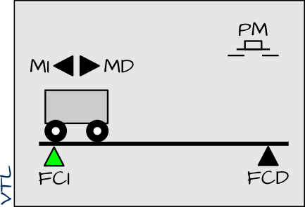

# 🛒 Carro Basico (TwinCAT 3)

## 📝 Descripción Funcional

El proyecto **Carro Básico** resuelve el clásico problema de automatización conocido como **el carro va y viene**, que consiste en un móvil que se desplaza longitudinalmente entre los dos extremos (izquierdo y derecho) de un tramo de vía.

<p align="center">
  
</p>

## 🧩 Elementos constituyentes

### Parte Opertiva

- Un **motor** con dos señales de mando (izquierda y derecha)
- Un par de **sensores finales de carrera** (izquierdo y derecho)

 ### Parte de Relación
 
 Consiste en un panel de operador básico compuesto únicamente por:

- Un **pulsador de marcha**, para iniciar el funcionamiento.
- Una **lámpara de marcha**, para indicar el estado del sistema.

## 🔄 Descripción del proceso

El funcionamiento del carro básico es como sigue.

1. El carro se pone en marcha hacia la derecha cuando se acciona el pulsador de marcha. 
1. Cuando el carro alcanza el final de carrera derecha invierte el sentido de la marcha.
1. El carro se deteine al alcanzar, de nuevo,  el final de carrera izquierda (posición inicial).

- **Condición inicial**: carro detenido sobre el final de carrera izquierda.

## 🔢 Modalidades

El proyecto contempla diferentes variantes de complejidad progresiva:

1. **Carro pulsado**. El carro inicia un viaje de ida y vuelta, únicamente, cuando estando en su posición inicial se acciona el pulsador de marcha.
1. **Carro temporizado**. El carro se detiene durante un determinado tiempo ($T_{espera}$) sobre el final de carrera derecha antes de iniciar el camino de regreso hacia su posición inicial.
1. **Carro limitado**. El carro realiza un determinado número de viajes de ida y vuelta (tarea) consecutivos cada vez que, estando en su posición inicial, se acciona el pulsador de marcha.
1. **Carro señalizado**. La lámpara de marcha se enciende de forma permanente para indicar que el carro está en funcionamiento y parpadea para indicar que el carro está en reposo.

## ⇄ Entradas y salidas

| Nombre | Tipo | Origen | Descripción |
| :--- | :--- | :--- | :--- |
| `PM` | `BOOL` | Input | Pulsador de Marcha |
| `FCI` | `BOOL` | Input | Final de Carrera Izquierda |
| `FCD` | `BOOL` | Input | Final de Carrera Derecha |
| `LM` | `BOOL` | Output | Lampara de Marcha |
| `MI` | `BOOL` | Output | Marcha Izquierda |
| `MD` | `BOOL` | Output | Marcha Derecha |

---

## 📂 Estructura simplificada del Repositorio

```text
TC3_Carro_Basico/
├── docs/
|   ├── diagrams/
│       ├── Carro_Basico_DRC.pdf   <-- Diagrama de Relés y Contactos (PDF)
│       └── Carro_Basico_GRF.pdf   <-- Diagrama Grafcet (PDF)
└── src/
    ├── TC3_Carro_Basico.sln       <-- Solución de Visual Studio (TwinCAT XAE)
    └── TC3_Carro_Basico/          <-- Proyecto TwinCAT
        └── Carro_Basico_PLC/      <-- Proyecto PLC
```

--- 

## 📄 Especificación funcional

Las siguientes especificaciones funcionales describen el comportamiento del carro (lógica de control) de una manera precisa utilizando los diagramas de relés y contactos y el lenguaje GRAFCET.

- [Diagrama de relés y contactos (PDF)](docs/diagrams/Carro_Basico_DRC.pdf)
- [Diagrama grafcet (PDF)](docs/diagrams/Carro_Basico_GRF.pdf)

---

## 💻 Código

Implementa el funcionamiento del carro va y viene en sus diferentes modalidades (básico, pulsado, temporizado, limitado y señalizado), empleando diferentes «lenguajes» de especificación (diagramas de relés y diagramas grafcet) y diferentes lenguajes de programación de la norma IEC 61131-3 (LD, SFC y ST).

- DRC → [LD]
- GRF → [SFC / ST / LD]

---

## 💻 Requisitos del Sistema

### Software

- **IDE:** Microsoft Visual Studio / TwinCAT 3 XAE (Versión mínima recomendada: **3.1.4024.x**).
- **Lenguajes:** Diagrams Ladder (LD), Texto Estructurado (ST) y Diagrama de Funciones Secuenciales (SFC).
- **Target System:** Controlador Beckhoff, runtime local o simulador UmRT_Default.

---

## 🚀 Puesta en Marcha

Para descargar, compilar y ejecutar este proyecto en el entorno de TwinCAT 3, sigua los siguientes pasos:

1. **Clonar el Repositorio:**

```bash
git clone https://github.com/vetorres-uma/TC3_Carro_Basico.git
```

2. **Abrir el Proyecto:** abra el archivo `.sln` (Solución) ubicado en la carpeta principal utilizando el entorno de ingeniería **TwinCAT XAE** (integrado en Visual Studio).
1. **Selección del Controlador:** seleccione el simulador **UmRT_Default** o controlador local o remoto (**Choose Runtime System**).
1. **Activación de Configuración:** en el modo **Configuración**, active la configuración (**Activate Configuration**) y reinicie TwinCAT en modo **Ejecución (Run Mode)**.
1. **Carga del Código:** en el entorno PLC, inicie la sesión y descargue el programa al PLC (**Login**).
1. **Poner el código en ejecución:** ejecute la lógica de control en el controlador (**Start**). Puede utilizar la visualización integrada en el proyecto PLC para facilitar la prueba.

---

## 🤝 Contribuciones

Este proyecto se utiliza con fines educativos. Las contribuciones, sugerencias o correcciones de errores son bienvenidas. Por favor, abra un *Issue* o envíe un *Pull Request* si desea contribuir.

---

## 🧑‍💻 Autor

- **Autor Principal:** Victor Torres (@vetorres-uma)

---

## ⚖️ Licencia

Este proyecto es de código abierto y está disponible bajo la **Licencia Pública General GNU (GPL)**.

- Consulte el archivo `LICENSE` para más detalles.
